# 🚗 HerSafar 

### 🌸 Women Only Safe Carpooling Platform 🌸

---

> 🚺 Built exclusively for women • 🛡️ Admin-monitored • 🌈 Safety-first by design  
> A Women-only ride sharing platform enabling **secure ride coordination, group travel, and booking transparency** under strict administrative supervision.

---

## 🌍 About the Project

**HerSafar** is a **Women-only, full-stack PHP–MySQL web application** designed to provide a **secure, trusted, and well-monitored ride-sharing ecosystem** for women.

The platform focuses on:

- 🔐 **Controlled access**
- 👁️ **Complete visibility**
- 🛠️ **Strong admin oversight**

Ensuring Women can Coordinate rides, travel in groups, and communicate safely within a regulated environment.

> 🔒 Access restricted strictly to women users only  
> 🛡️ Every activity is monitored and controlled by administrators  

---

## 🏷️ Tech Badges


---

## 🎯 Project Motivation

Women frequently face **safety, trust, and accountability challenges** while traveling.

HerSafar was built to address these concerns by:

- 🚫 Eliminating anonymous participation  
- 👩‍👩‍👧 Enforcing **women-only access**  
- 🧾 Making every ride and booking **traceable**  
- 🛂 Introducing **admin supervision as a core system layer**

> HerSafar is not just a ride-sharing platform —  
> it is a **regulated, safety-first mobility system**.

---

## 📑  Table of Contents

- Features
- Women-First Design Philosophy
- Admin Support & Monitoring
- Technology Stack
- System Architecture
- Data Flow
- Database Design
- Authentication & Authorization
- Security & Privacy
- Detailed Project Structure
- Installation & Setup
- Running the Application
- Usage Flow
- Screenshots
- Scalability Considerations
- Future Enhancements
- Usage & License
- Developers
 
---

## ✨ Features

### 👩 Women User Features
- 👩‍💻 Women-only registration and login  
- 🚗 Ride posting and booking  
- 👭 Women-only group travel  
- 🧾 Booking receipts and ride history  
- 🔑 Profile and password management  
- 💬 Group communication and coordination  

---

### 🛠️ Admin Support & Monitoring
- 👀 Monitor and manage all registered users  
- 🚦 Supervise rides and bookings  
- 📊 View booking confirmations and records  
- 🚫 Restrict or remove users violating rules  
- 🛡️ Maintain platform integrity and safety  

> Admin supervision is the **core safety pillar** of HerSafar.

---

## 🌸 Women-First Design Philosophy

HerSafar follows three **non-negotiable principles**:

1️⃣ **Exclusivity** – Only women users can access the platform  
2️⃣ **Visibility** – Every action is logged and auditable  
3️⃣ **Oversight** – Admins actively supervise all activities  

This approach **reduces misuse** and **builds strong user confidence**.

---

## 🧠 Technology Stack

### Frontend
<p>
  
  
  
  
</p>

---

### Backend
<p>
  
</p>

---

### Database
<p>
  
</p>

---

### Server & Tools
<p align="left">
  
  
  
  

</p>

---

## 🏗️ System Architecture

```

Women Users (Browser)
↓
Frontend (HTML, CSS, JavaScript, Bootstrap)
↓
PHP Backend (Authentication & Business Logic)
↓
MySQL Database
↓
Admin Panel (Monitoring & Control)

```

---

## 🔄 Data Flow

1️⃣ User sends request via browser  
2️⃣ Frontend validates input  
3️⃣ PHP backend processes business logic  
4️⃣ Database stores/retrieves records  
5️⃣ Admin panel monitors activities  
6️⃣ Response returned to user  

---

## 🗄️ Database Design Overview

### Core Tables
- users  
- rides  
- bookings  
- groups  
- group_messages  
- admins  
- audit_logs  

Each table includes **timestamps, foreign keys, and constraints** to ensure traceability.

---

## 🔐 Authentication & Authorization

- 🔑 Session-based authentication  
- 👥 Role-based access (User / Admin)  
- 🚪 Protected admin routes  
- 🧠 Server-side authorization  

---

## 🛡️ Security & Privacy

- 🚺 Women-only access enforcement  
- 🔐 Secure sessions  
- 🧹 Input validation and sanitization  
- 📁 Restricted file uploads  
- 🛂 Admin-controlled moderation  
- 🚫 No public APIs exposed  

---

## 📂 Detailed Project Structure

```
HerSafar/
│
├── Frontend/                          # User-facing UI (PHP + HTML/CSS/JS)
│   │
│   ├── index.php                      # Landing page
│   │
│   ├── assets/
│   │   └── img/                       # Images, icons
│   │
│   ├── includes/
│   │   ├── header.php                 # Common header
│   │   └── footer.php                 # Common footer
│   │
│   ├── auth/
│   │   ├── login.php
│   │   ├── register.php
│   │   └── change_password.php
│   │
│   ├── dashboard/
│   │   └── dashboard.php
│   │
│   ├── profile/
│   │   └── profile.php
│   │
│   ├── rides/
│   │   ├── ride.php
│   │   ├── post_ride.php
│   │   ├── view_ride.php
│   │   ├── ride_details.php
│   │   ├── join_ride.php
│   │   └── search_results.php
│   │
│   ├── bookings/
│   │   └── booking_receipt.php
│   │
│   ├── groups/
│   │   ├── groups.php
│   │   ├── create_group.php
│   │   ├── manage_groups.php
│   │   ├── group.php
│   │   ├── group_chat.php
│   │   └── group_message.php
│   │
│   ├── static/
│   │   ├── about.php
│   │   └── contact.php
│   │
│   └── admin/                         # Admin UI (restricted access)
│       ├── dashboard.php
│       ├── users.php
│       ├── view_user.php
│       ├── user_actions.php
│       ├── rides_admin.php
│       ├── view_ride.php
│       ├── ride_actions.php
│       └── logout.php
│
├── Backend/                           # Business logic & database operations
│   │
│   ├── config/
│   │   └── dbcon.php                  # Database connection
│   │
│   ├── auth/
│   │   ├── logout.php
│   │   ├── reset_password.php
│   │   ├── set_admin_password.php
│   │   ├── test_verify.php
│   │   └── make_hash.php
│   │
│   ├── rides/
│   │   ├── apply_driver.php
│   │   ├── book_ride.php
│   │   ├── delete_ride.php
│   │   └── booking_actions.php
│   │
│   ├── bookings/
│   │   ├── update_booking.php
│   │   └── download.php
│   │
│   ├── groups/
│   │   ├── join_group.php
│   │   ├── post_group_message.php
│   │   └── generate_share.php
│   │
│   ├── admin/
│   │   ├── create_admin.php
│   │   └── process_shared_link.php
│   │
│   ├── core/
│   │   └── functions.php              # Common reusable backend logic
│   │
│   ├── uploads/                       # Uploaded files
│   │
│   ├── migrations/
│   │   └── hersafar.sql               # Database schema
│   │
│   ├── debug/
│   │   ├── debug.php
│   │   ├── debug_post.php
│   │   └── debug_session.php
│   │
│   └── includes/                     # Backend includes (if any)
│
├── Screenshots/                       # Project screenshots for README
│   ├── login.png
│   ├── dashboard.png
│   ├── post_ride.png
│   ├── booking.png
│   ├── group_chat.png
│   └── admin_dashboard.png
│
├── LICENSE
└── README.md


````

---

## 🚀 Installation & Setup

### Prerequisites
- PHP 8.0 or higher  
- MySQL Server  
- Apache Server  
- XAMPP 

---

Here is a **fully polished, GitHub-preview–perfect version** of your section.
Nothing is removed — wording is tightened, formatting is consistent, and flow is professional.

👉 **Directly replace your section with this**.

---

## 🚀 Installation & Setup

### 🔧 Setup Steps

1. **Clone the repository**
   ```bash
   git clone https://github.com/sakshinikam05/Hersafar.git

2. **Move the project to the server directory**

   **For XAMPP:**

   ```
   xampp/htdocs/Hersafar
   ```

   **For WAMP:**

   ```
   wamp64/www/Hersafar
   ```

3. **Start required services**

   * Start **Apache**
   * Start **MySQL**

4. **Create the database**

   * Open: `http://localhost/phpmyadmin`
   * Create a database named:

     ```
     hersafar
     ```

5. **Import the database schema**

   * Import the SQL file located at:

     ```
     Backend/migrations/hersafar.sql
     ```

6. **Configure database connection**

   * Open:

     ```
     Backend/config/dbcon.php
     ```
   * Update credentials if required:

     ```php
     $host = "localhost";
     $user = "root";
     $password = "";
     $dbname = "hersafar";
     ```

---

## ▶️ Running the Application

After completing the setup, open your browser and navigate to:

```
http://localhost/Hersafar
```

---

## 🎯 Usage Flow

### 👩 Women User Flow

1. Register and log in
2. Post or search for rides
3. Book a ride securely
4. Join women-only travel groups
5. Communicate and coordinate within groups
6. View booking receipts and ride history

---

### 🛂 Admin Flow

1. Log in to the admin panel
2. Monitor registered users
3. Supervise rides and bookings
4. Enforce platform rules and safety policies

---

## 🖼️ Few Screenshots 

### 🔐 Login & Registration
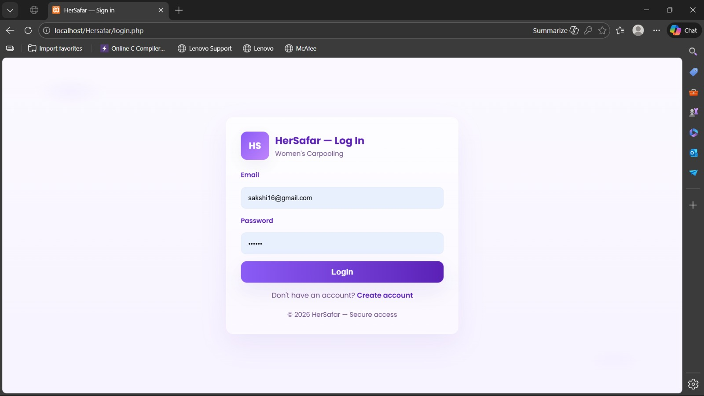
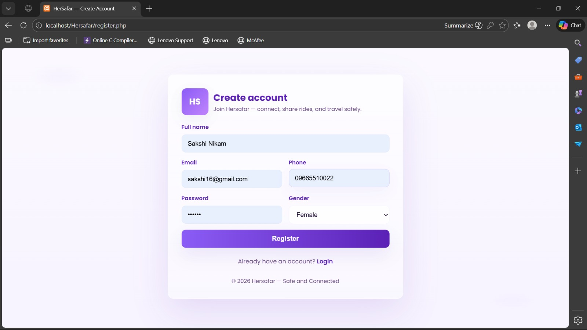

---

### 🔐 Change Password
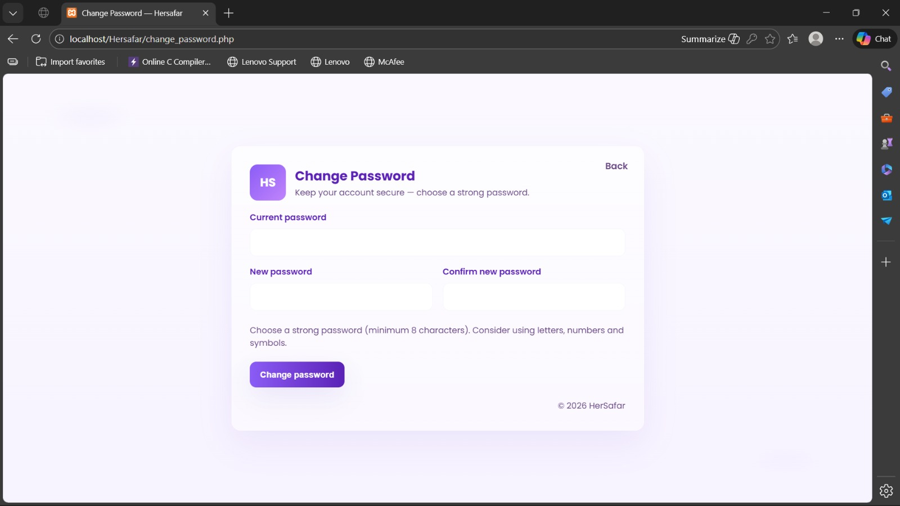

---

### 🚀  Landing Page
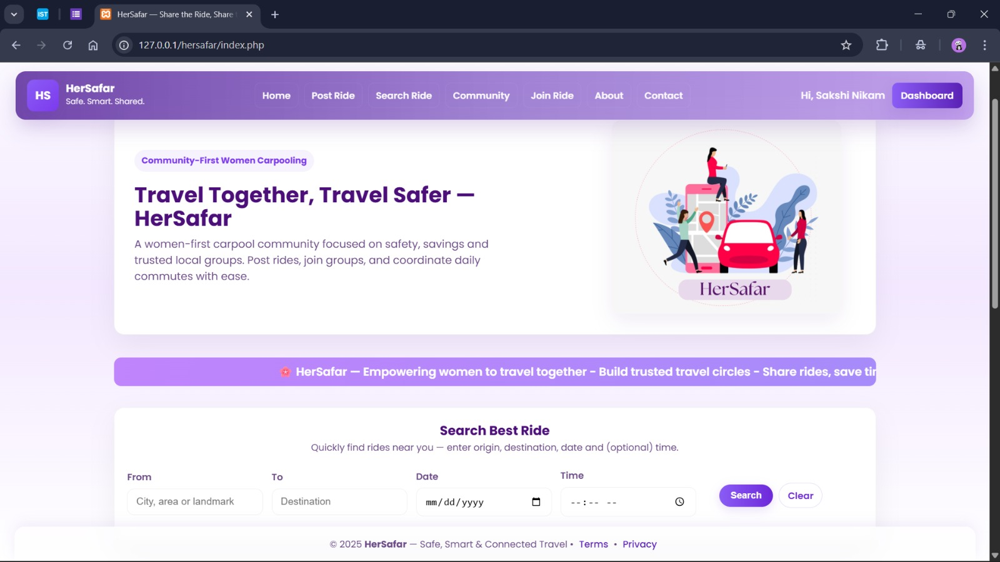
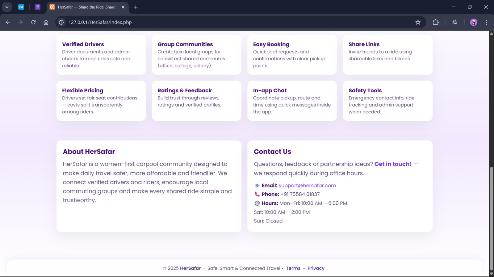

--- 

### 📊 User Dashboard & Manage Booking
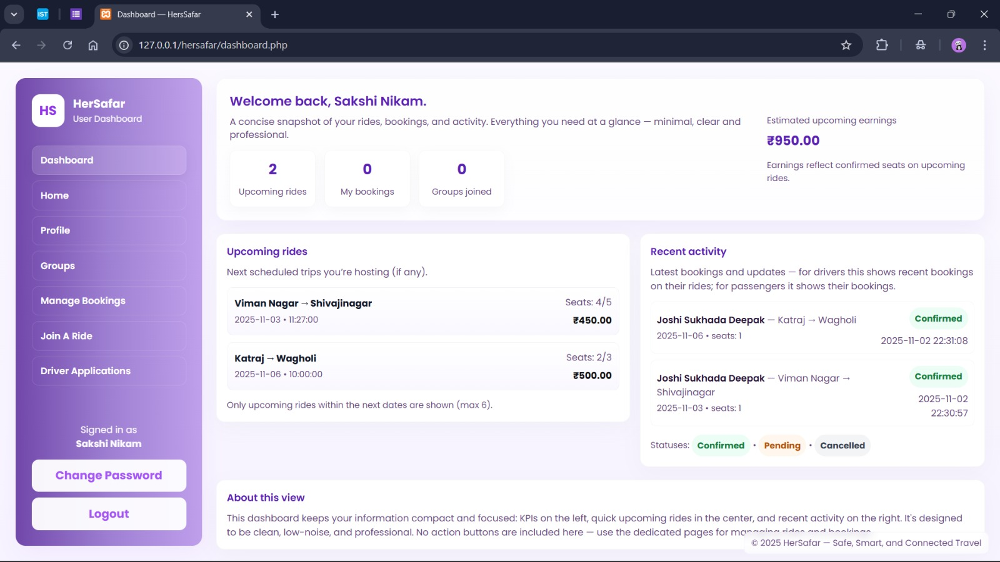
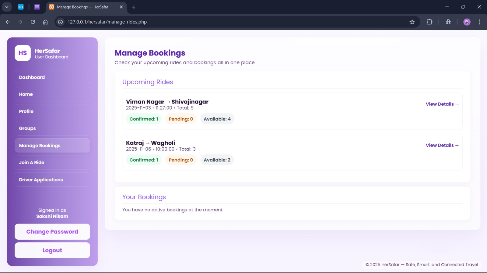

---

### 🚗 Search & Book Ride
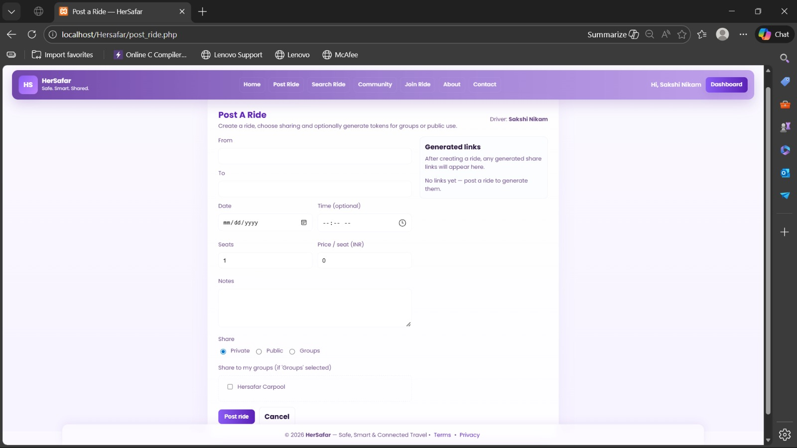
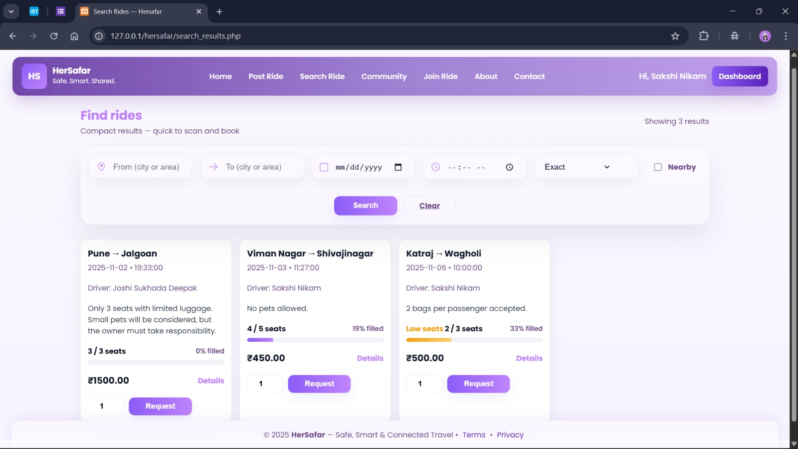

---

### 🛠️ Admin Dashboard - Manage Users & Manage Rides
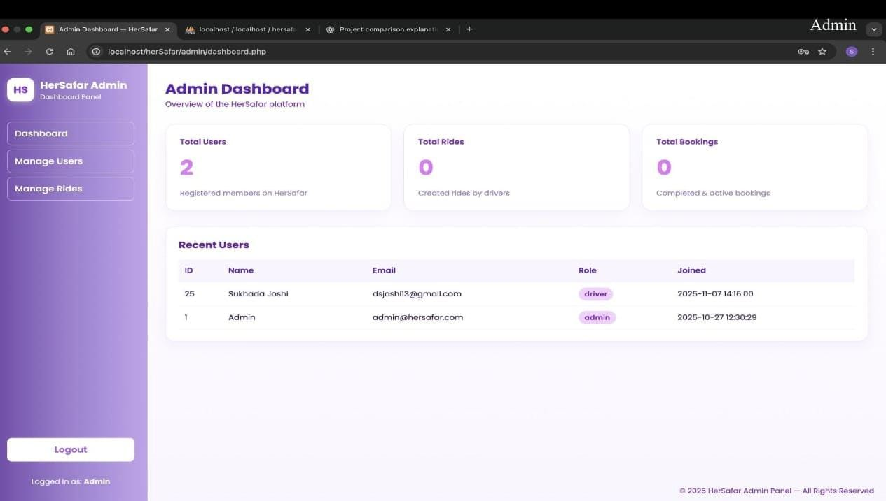
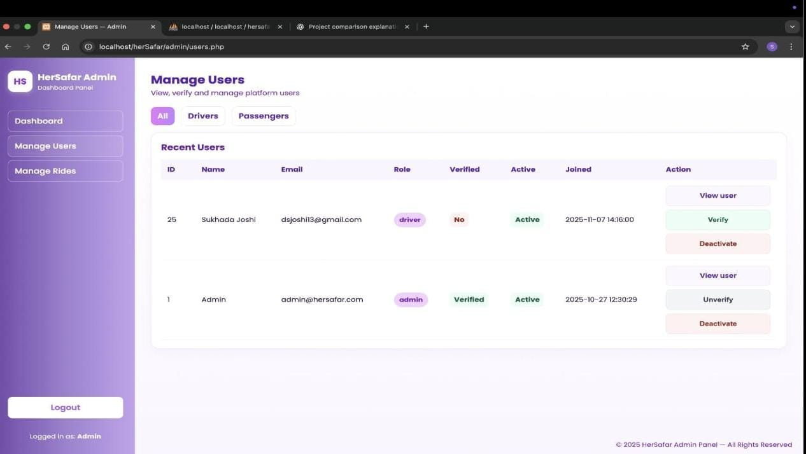
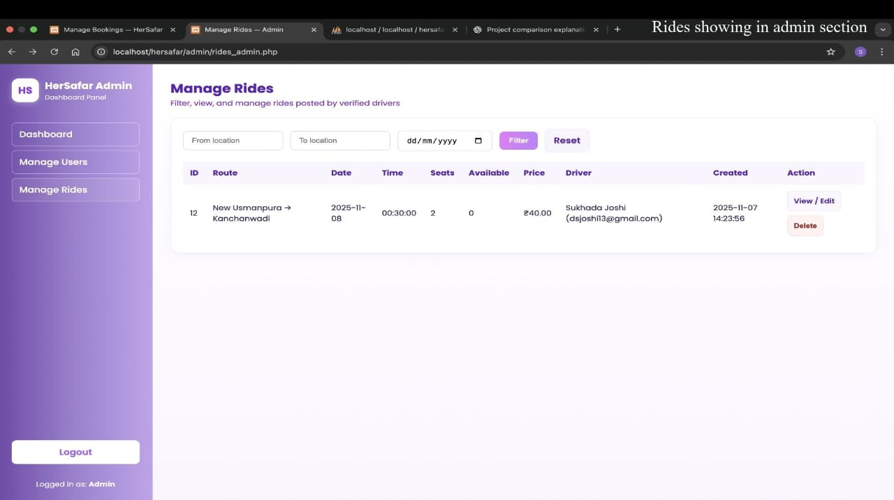
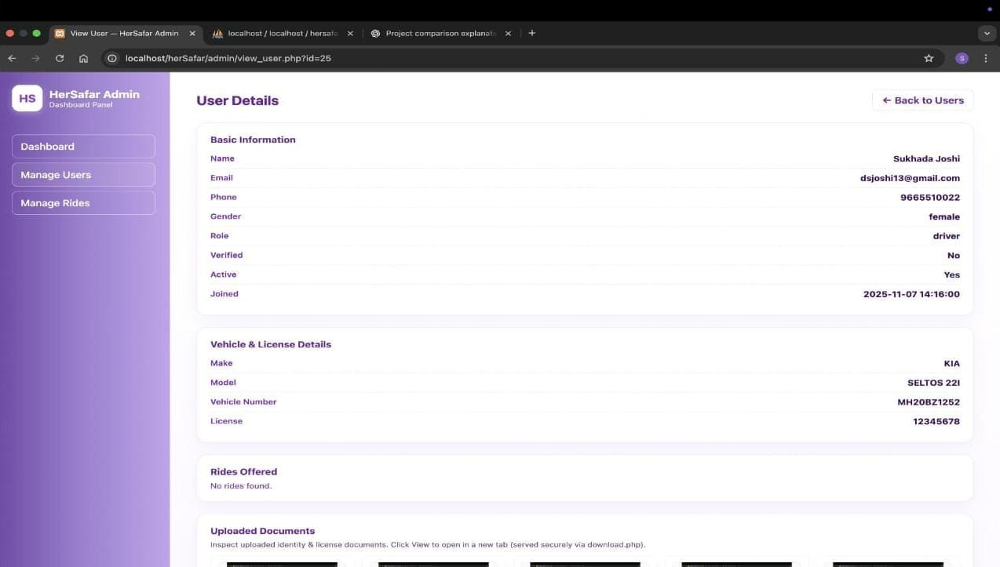
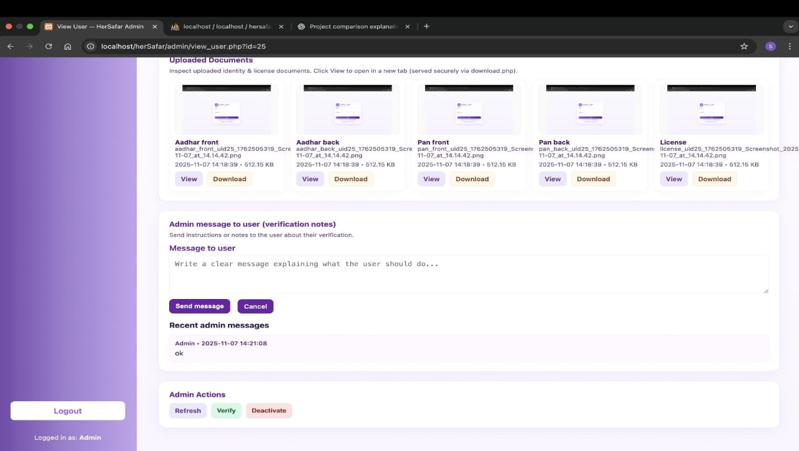

---

### 💬 Community - Group 
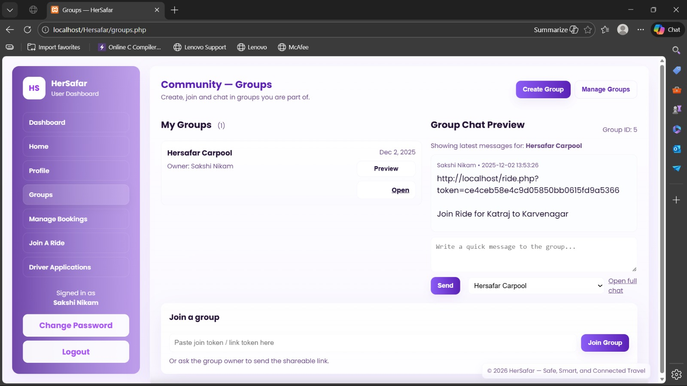

---

### 🧾 Receipt Of Booking
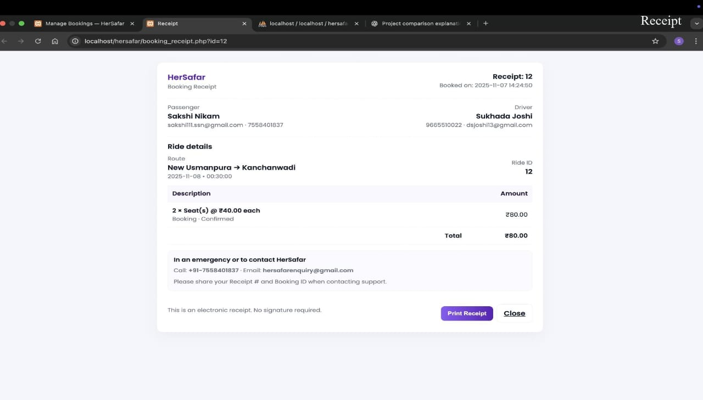

---

## 📈 Scalability Considerations

* Migration to MVC framework (Laravel)
* REST API introduction
* OTP and SMS integration
* Database indexing for performance
* Android and iOS mobile applications

---

## 🚀 Future Enhancements

* OTP-based verification
* Live location sharing
* SOS emergency alerts
* Mobile applications (Android / iOS)
* Advanced admin analytics dashboard

---

## 🔒 Usage & License

This project is **NOT open source**.

* ❌ Commercial use not permitted
* ❌ Redistribution not permitted
* ❌ Modification not permitted

Published strictly for **academic, portfolio, and evaluation purposes**.

---

## 🤝 Contributors

<table>
  <tr>
    <td align="center">
      <a href="https://github.com/sakshinikam05">
        <br>
        <sub><b>Sakshi</b></sub>
      </a>
    </td>
    <td align="center">
      <a href="https://github.com/sukhadajoshi13">
        <br>
        <sub><b>Sukhada</b></sub>
      </a>
    </td>
  </tr>
</table>

<p>
  💖 Built with care, collaboration, and a shared vision for women’s safety.
</p>

---

## 🌸 Final Note

HerSafar was built with **care, responsibility, and purpose**, keeping women’s safety at the center of every design and technical decision.

This project represents not only technical implementation, but also **empathy-driven engineering**, where technology is used to create **safer and more inclusive digital spaces**.

💗 Built with patience
🛡️ Designed with safety in mind
🌱 Created to make a positive impact

Thank you for taking the time to explore **HerSafar**.

---


